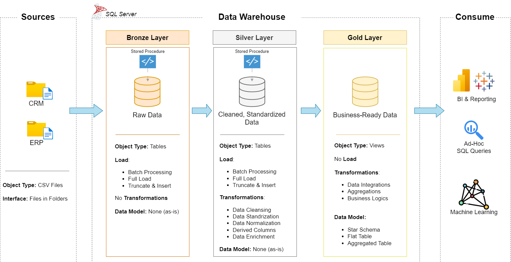

# Data Warehouse and Analytics Project

Welcome to the Data Warehouse and Analytics Project repository.
This project demonstrates a comprehensive data warehousing and analytics solution — from building a data warehouse to generating actionable insights.
, it highlights industry best practices in data engineering and analytics.

## 📖 Project Overview
This project involves:

1. **Data Architecture**: Designing a Modern Data Warehouse Using Medallion Architecture **Bronze**, **Silver**, and **Gold** layers.
2. **ETL Pipelines**: Extracting, transforming, and loading data from source systems into the warehouse.
3. **Data Modeling**: Developing fact and dimension tables optimized for analytical queries.
4. **Analytics & Reporting**: Creating SQL-based reports and dashboards for actionable insights.
---
## 🛠️ Important Links & Tools:

Everything is for Free!
- **[Datasets](datasets/):** Access to the project dataset (csv files).
- **[SQL Server Express](https://www.microsoft.com/en-us/sql-server/sql-server-downloads):** Lightweight server for hosting your SQL database.
- **[SQL Server Management Studio (SSMS)](https://learn.microsoft.com/en-us/sql/ssms/download-sql-server-management-studio-ssms?view=sql-server-ver16):** GUI for managing and interacting with databases.
- **[Git Repository](https://github.com/):** Set up a GitHub account and repository to manage, version, and collaborate on your code efficiently.
- **[DrawIO](https://www.drawio.com/):** Design data architecture, models, flows, and diagrams.
## 🚀 Project Requirements

### Building the Data Warehouse (Data Engineering)

#### Objective
Develop a modern data warehouse using SQL Server to consolidate sales data, enabling analytical reporting and informed decision-making.

#### Specifications
- **Data Sources**: Import data from two source systems (ERP and CRM) provided as CSV files.
- **Data Quality**: Cleanse and resolve data quality issues prior to analysis.
- **Integration**: Combine both sources into a single, user-friendly data model designed for analytical queries.
- **Scope**: Focus on the latest dataset only; historization of data is not required.
- **Documentation**: Provide clear documentation of the data model to support both business stakeholders and analytics teams.

---
### BI: Analytics & Reporting (Data Analysis)

#### Objective
Develop SQL-based analytics to deliver detailed insights into:
- **Customer Behavior**
- **Product Performance**
- **Sales Trends**
These insights empower stakeholders with key business metrics, enabling strategic decision-making.  
## 🏗️ Data Architecture
The data architecture for this project follows Medallion Architecture **Bronze**, **Silver**, and **Gold** layers:

## 📂 Repository Structure
```
data-warehouse-project/
│
├── datasets/                           # Raw datasets used for the project (ERP and CRM data)
│
├── docs/                               # Project documentation and architecture details
│   ├── data_integration                # Draw.io file shows how tables are related
│   ├── data_architecture.drawio        # Draw.io file shows the project's architecture
│   ├── data_catalog.md                 # Catalog of datasets, including field descriptions and metadata
│   ├── data_flow.drawio                # Draw.io file for the data flow diagram
│   ├── data_models.drawio              # Draw.io file for data models (star schema)
│
├── scripts/                            # SQL scripts for ETL and transformations
│   ├── bronze/                         # Scripts for extracting and loading raw data
│   ├── silver/                         # Scripts for cleaning and transforming data
│   ├── gold/                           # Scripts for creating analytical models
│   ├── analytics/                      # Scripts for analytical SQL queries were developed to explore and analyze the data.
├── tests/                              # Test scripts and quality files
│
├── README.md                           # Project overview and instructions
```
---

---
## ⚙️ ETL Process

### ETL Pipeline Workflow

```
┌─────────────────────────────────────────┐
│       SOURCE SYSTEMS (CSV FILES)        │
│  ┌────────────┐      ┌────────────┐    │
│  │ CRM System │      │ ERP System │    │
│  │  (6 CSVs)  │      │  (3 CSVs)  │    │
│  └────────────┘      └────────────┘    │
└─────────────────────────────────────────┘
              ↓ (Extract)
┌─────────────────────────────────────────┐
│       STEP 1: BRONZE LAYER              │
│     ✓ Load raw data as-is               │
│     ✓ No transformations                │
│     ✓ Direct CSV import                 │
└─────────────────────────────────────────┘
              ↓ (Transform)
┌─────────────────────────────────────────┐
│       STEP 2: SILVER LAYER              │
│     ✓ Data quality checks               │
│     ✓ NULL value handling               │
│     ✓ Standardize formats               │
│     ✓ Remove duplicates                 │
│     ✓ Type conversions                  │
└─────────────────────────────────────────┘
              ↓ (Transform)
┌─────────────────────────────────────────┐
│       STEP 3: GOLD LAYER                │
│     ✓ Merge CRM + ERP data              │
│     ✓ Create surrogate keys             │
│     ✓ Generate star schema              │
│     ✓ Apply business rules              │
│     ✓ Optimize for analytics            │
└─────────────────────────────────────────┘
              ↓ (Load)
┌─────────────────────────────────────────┐
│   ANALYTICS & REPORTING LAYER           │
│  ✓ Dashboards                           │
│  ✓ Reports                              │
│  ✓ Business Intelligence                │    │
└─────────────────────────────────────────┘
```
---

## 🚀 How to Run This Project 
### 1️⃣ Prerequisites

Make sure you have:

- SQL Server (2019 or later recommended)
- SQL Server Management Studio (SSMS)
- - Access to create databases and run stored procedures
- The project folder including:
- - `/datasets` CSV files
  - `/bronze` scripts
  - `/silver` scripts
  - `/gold` scripts
  

---
# 🥉 Step 1 — Create Bronze Layer (Raw Data Ingestion)
### 1️⃣ Initialize Database

Run:

`init_database.sql`

This will:
- Drop and recreate the database
- Create schemas:
  - `bronze`
  - `silver`
  - `gold`
## 2️⃣ Create Bronze Tables

Run:

`Ddl Query for Bronze Layer.sql`

This creates raw source tables in the `bronze` schema.

---

### 3️⃣ Create Bronze Load Procedure

Run:

`Stored Procedures for Bronze Layer.sql`

This creates:

`bronze.load_bronze`

---
### 4️⃣ Update CSV File Paths

Inside `bronze.load_bronze`, update the `BULK INSERT` file paths to match your local machine.

---

### 5️⃣ Load Bronze Data

Execute:

```sql
EXEC bronze.load_bronze;
```
---

# 🥈 Step 2 — Create Silver Layer (Data Cleaning & Transformation)

The Silver layer transforms raw Bronze data into clean, structured, and standardized datasets.

---

## 1️⃣ Create Silver Tables

Run:

`Ddl Query for Silver Layer.sql`

This will:

- Drop existing Silver tables (if any)
- Create structured tables in the `silver` schema

---

## 2️⃣ Create Silver Load Procedure

Run:

`Stored Procedures for Silver Layer.sql`

This creates:

`silver.load_silver`

---

## 3️⃣ Execute Silver ETL Process

Run:

```sql
EXEC silver.load_silver;
```
---
# 🥇 Gold Layer — Business Model (Star Schema)

The Gold layer exposes business-ready data using a Star Schema design.

It includes:

- 2 Dimension Views
- 1 Fact View

---

## 🎯 Gold Objects

- `gold.dim_customers`
- `gold.dim_products`
- `gold.fact_sales`

These are implemented as SQL Views built on top of Silver tables.

---

## 1️⃣ Create Gold Views

Run:

`Ddl gold layer.sql`

This script:

- Drops existing Gold views (if they exist)
- Recreates:
  - `gold.dim_customers`
  - `gold.dim_products`
  - `gold.fact_sales`

---

